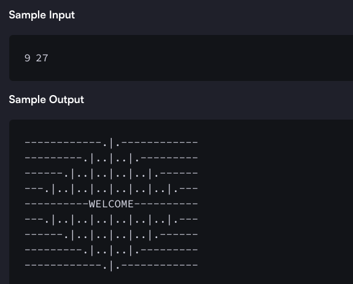

# Drawing a Mat Pattern

Mat size must be n*m. (nis an odd natural number, and m is 3 times n.)
The design should have 'WELCOME' written in the center.
The design pattern should only use `|`, `.` and `-` characters.

